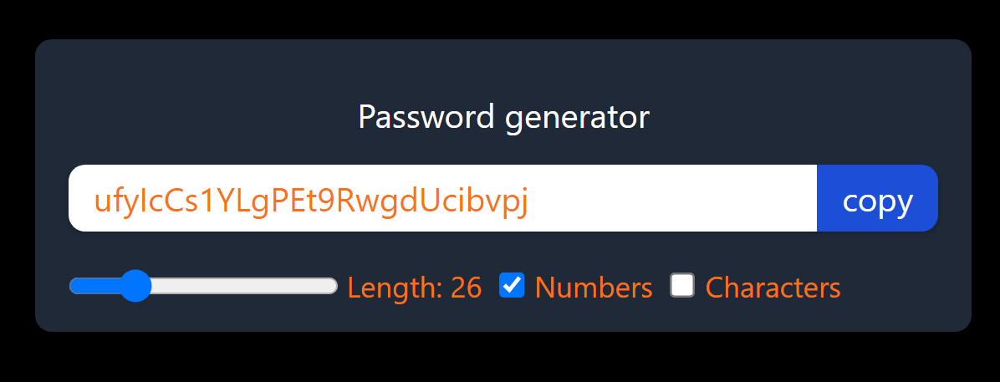

# Password Generator

A simple and customizable password generator built with React and Vite. This application allows users to generate passwords with specific criteria, such as length, inclusion of numbers, and special symbols. It also includes a convenient copy button to quickly copy the generated password to the clipboard.

## Features

- Set the length of the password using a slider.
- Enable or disable numbers and symbols in the password using checkboxes.
- Generate a new password on demand.
- Copy the generated password to the clipboard with a single click.
- Utilizes React hooks: `useState`, `useCallback`, `useEffect`, and `useRef`.

## Deployed
[Password Generator](https://password-generator-nu-beige.vercel.app/)

## Demo



## Getting Started

### Prerequisites

- Node.js (version 14.x or later)
- npm

### Installation

1. Clone the repository:

   ```bash
   git clone https://github.com/namanmalhotra26/PasswordGenerator.git
   cd PasswordGenerator
   ```

2. Install the dependencies:

   ```bash
   npm install
   ```

3. Start the development server:

   ```bash
   npm run dev
   ```

4. Open your browser and navigate to `http://127.0.0.1:5173/` to see the application in action.

## Usage

1. Use the slider to set the desired length of the password.
2. Check or uncheck the boxes to include numbers and symbols in the password.
3. Click the "Generate Password" button to generate a new password.
4. Click the "Copy" button to copy the generated password to the clipboard.

## Technologies Used

- React
- Vite
- JavaScript
- CSS
